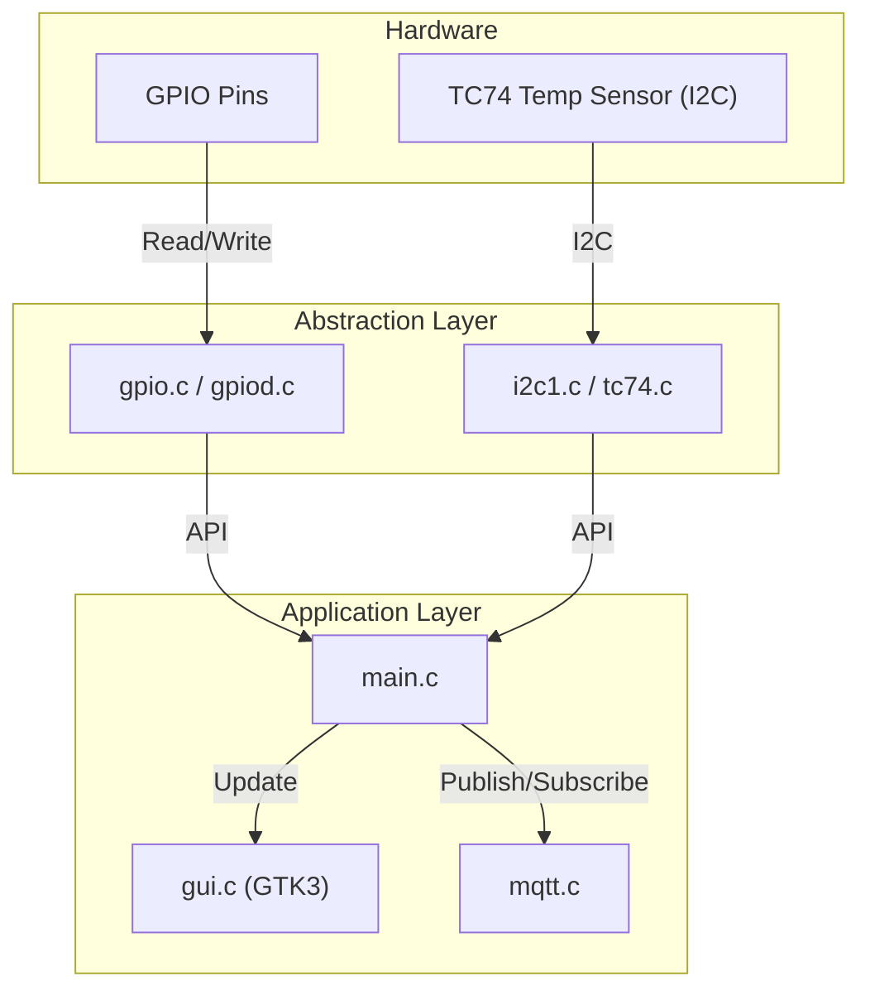
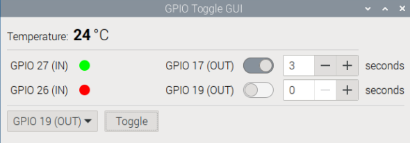

# Raspberry Pi GPIO & Sensor GUI

A modular, multi-threaded Raspberry Pi C project for real-time GPIO monitoring/control, I2C temperature sensing, MQTT integration, and a GTK3 GUI.

---

## Features

- **GPIO Monitoring & Control**: Real-time monitoring and toggling of GPIO pins via a GTK3 GUI.
- **I2C Temperature Sensor**: Reads temperature from a TC74 sensor over I2C and displays it in the GUI.
- **MQTT Integration**: Publishes and/or receives temperature updates via MQTT (Paho C).
- **Error Logging**: Logs errors to `error.log` for troubleshooting.
- **Daemonized Service**: Can run as a background service with systemd.
- **GPIOD Option**: Supports efficient GPIO control via GPIOD.
- **Clean Resource Management**: Proper cleanup for GPIO, MQTT, and GTK resources.

---

## Technologies

- **PJ's GPIO Library**: Low-level GPIO access for Raspberry Pi.
- **GPIOD Library**: Modern Linux GPIO control.
- **I2C (TC74)**: Reads temperature from a Microchip TC74 sensor.
- **MQTT (Paho C)**: Lightweight messaging protocol for temperature updates.
- **GTK3**: GUI framework for the desktop interface.
- **CMake**: Cross-platform build system.
- **Systemd**: Linux service manager for daemon mode.
- **pinctrl**: CLI tool for configuring and reading GPIO pin states.

---

## Architecture



---

## GUI Screenshot



*GPIO Sensor GUI*

## Quick Setup

### 1. Install Dependencies

```bash
sudo apt update
sudo apt install -y cmake build-essential pkg-config libgtk-3-dev libgpiod-dev gpiod libpaho-mqtt-dev pinctrl
```

### 2. Enable I2C and Connect TC74

- Enable I2C via `raspi-config` or by editing `/boot/config.txt`.
- Connect the TC74 sensor to the I2C bus.

### 3. Install PJ's GPIO Library

```bash
cd PJ_RPI
mkdir build
cd build
cmake ..
make
sudo make install
```
[GitHub: PJ_RPI](https://github.com/Pieter-Jan/PJ_RPI)

---

## Build the Application

```bash
cd TempSensor/Source
mkdir build
cd build
cmake ..
make
```

---

## Usage

### GPIO Pinout

- **GPIO 19** and **GPIO 17** are outputs.
- **GPIO 26** and **GPIO 27** are inputs.
- The GUI displays the state of all pins, allows toggling outputs, and shows the temperature from the TC74 sensor (via I2C and/or MQTT).
- A dropdown and toggle button at the bottom allow selecting and toggling outputs directly.

---

### GPIO Pin Control

Set pin modes:
```bash
pinctrl set 26 ip
pinctrl set 27 ip
pinctrl set 19 op
pinctrl set 17 op
```
Read pin states:
```bash
pinctrl get 19,26
pinctrl get 17,27
```
Set outputs high:
```bash
pinctrl set 19 op dh
pinctrl set 17 op dh
```

---

### Running the Application

#### GUI + MQTT Mode

To launch the full GUI with MQTT integration:
```bash
sudo ./TempSensor --mqtt --gtk
```
- `--mqtt` enables MQTT temperature updates.
- `--gtk` launches the GTK GUI.

#### Daemon (MQTT Publisher) Mode

To run as a background service (publishes temperature to MQTT, no GUI):
```bash
sudo ./TempSensor --temp 3
```
- `--temp 3` reads the TC74 sensor every 3 seconds and publishes to MQTT.

#### Monitor MQTT

To monitor temperature messages published by the sensor:
```bash
mosquitto_sub -t sensor/temperature
```

---

## Service Management

Install and manage the systemd service:
```bash
sudo cp TempSensor/Source/config/temp-sensor.service /etc/systemd/system/
sudo systemctl daemon-reload
sudo systemctl enable temp-sensor.service
sudo systemctl start temp-sensor.service
```
To restart the service:
```bash
sudo systemctl restart temp-sensor.service
```
The service file runs:
`/home/pi/embedded/rpi-temp-sensor/TempSensor/Source/build/TempSensor --temp 3`

---

## Error Logging

Errors are logged to `error.log` in the same directory as the executable, with timestamps and messages for troubleshooting.

---

## Development Environment (VS Code)

For best IntelliSense, add this to your `.vscode/c_cpp_properties.json`:
```json
{
  "includePath": [
    "${workspaceFolder}/**",
    "/usr/include/gtk-3.0",
    "/usr/include/glib-2.0",
    "/usr/lib/arm-linux-gnueabihf/glib-2.0/include",
    "/usr/include/gio-unix-2.0/",
    "/usr/include/cairo",
    "/usr/include/pango-1.0",
    "/usr/include/harfbuzz",
    "/usr/include/gdk-pixbuf-2.0",
    "/usr/include/pixman-1",
    "/usr/include/freetype2",
    "/usr/include/libpng16"
  ]
}
```

---

## Notes

- The GUI provides real-time feedback for GPIO and temperature.
- All resources (GPIO, MQTT, GTK) are properly cleaned up on exit.
- The project is modular: see `gpio/`, `i2c/`, `mqtt/`, and `gtk/` for source organization.
